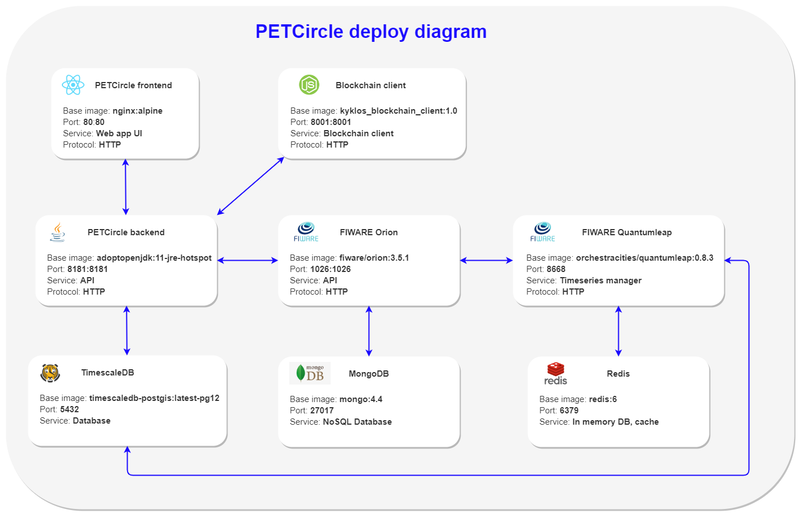

# Kyklos PET-Circle deploy

Set **HOST** and **BLOCKCHAIN_PRIVATEKEY** environment variables in .env file.

Start up services:

    docker compose up -d

Tear down services:

    docker compose down

> Backend Swagger API docs `http://${HOST}:8181/docs`

#

